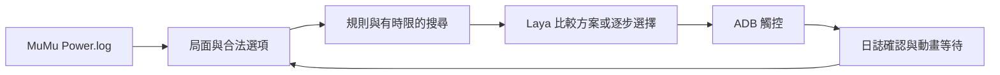

# 架構

程式位於 `src/laya_hearthstone/`。每次決策以最新日誌局面為基礎，只執行遊戲提供的一個合法動作，再重新觀察。

| 職責 | 主要模組 |
| --- | --- |
| 桌面 UI | `android_app.py`、`panel_view.py` |
| 排位與選單 | `ranked_session.py`、`menu_navigation.py` |
| 日誌與辨識 | `reader.py`、`android_reader.py`、`perception.py` |
| 合法動作與評分 | `strategy.py`、`choices.py`、`mulligan.py` |
| 模型決策與預算 | `advisor.py`、`decision_pipeline.py` |
| 已知效果搜尋 | `card_simulator.py`、`turn_search.py`、`turn_end.py`、`survival.py`、`enchantments.py` |
| 觸控與確認 | `android_device.py`、`android_hands.py`、`android_layout.py`、`executor.py` |
| 牌組與參考 | `deck_profiles.py`、`hsreplay_import.py` |
| 共用支援 | `paths.py`、`snapshot_io.py`、`device_lease.py`、`geometry.py` |
| Windows 實驗 | `app.py`、`hands.py`、`win_input.py`、`background_input.py`、`maa_input.py`、`window_preview.py`、`input_test_ui.py` |

## 決策分工

1. 從日誌取得真實合法動作；程式在可證明的效果範圍內優先找斬殺或保命路線。
2. 附上選定牌組的換牌、打法、combo 與公開對戰資訊。
3. 以時間、深度及寬度上限展開已知效果，保留少量方案；未知效果停止該推演分支。
4. Laya 比較方案，或先選具體卡牌／動作，再選目標。多語模型輸入與選項使用實際 tokenizer 檢查預算。

搜尋中的虛擬後續動作不直接執行；執行器只接受當前真實合法選項。對手隱藏手牌與牌庫順序不送入模型，僅提供可見場面、手牌數與公開出牌紀錄。

## 執行分工

MuMu 觸控座標依 Android 截圖尺寸及手牌／場位數量計算，與 Windows 游標位置分離。操作前等待動畫穩定並重新確認狀態；操作後核對日誌事件。一般操作間隔 2.5 秒，未確認且局面未變的單步操作最多重試一次。跨執行緒與程序的裝置鎖防止重複控制；停止要求會在下一個安全檢查點取消後續輸入。

主流程預先載入模型，並為回合結束保留時間。未知效果、秘密或複雜觸發可能降低搜尋覆蓋，會退回逐步選擇，而非假定所有效果已算完。
